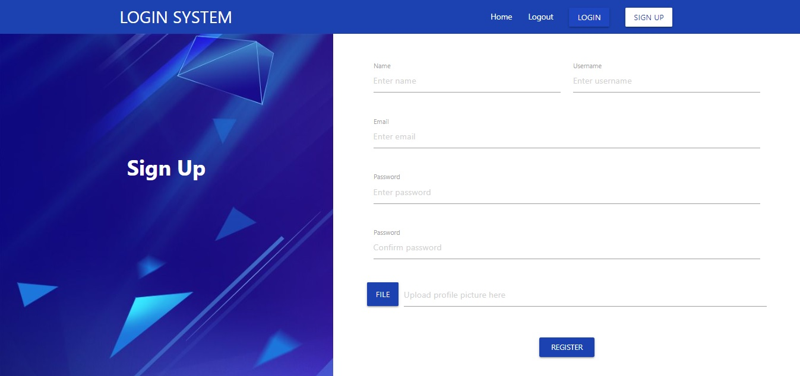

# Login System - Node.js

## Description

A login and sign up application using Node.js and ExpressJS.

### Screenshot

### Features

- Sign up users
- Login users
- Logout users
- Form validation
- Home page restrictions unless logged in

### Technologies

- Node.js
- JavaScript
- MongoDB
- HTML
- CSS

### Prerequisites

- [Node.js](https://nodejs.org/en/download/) installed on your system
- [MongoDB](https://www.mongodb.com/download-center/enterprise) installed on your system

## How to Use

### Installation

Run:

`npm install`

### Usage

To start the application run the following command in the root directory:

`npm start`

Once done, in the browser copy and paste the following URL:

`http://localhost:3000/`

### Accessing the database

Open up the command line

1. Navigate to this directory - `C:\Program Files\MongoDB\Server\4.2\bin`
2. Once there, enter the command `mongo`
3. Next enter `use login-sys-nodejs` - You are now using the login system database
   ⋅⋅⋅ To learn more about MongoDB commands [here](https://docs.mongodb.com/manual/mongo/)

## License

This project is licensed under the MIT License
